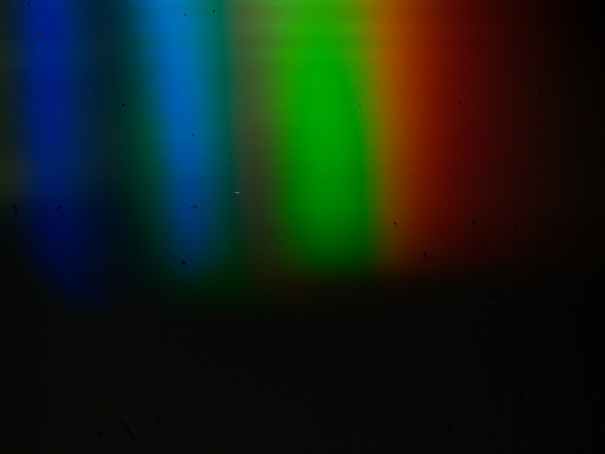

```{r Rsetup, include=FALSE}
knitr::opts_chunk$set(echo = TRUE)
library(reticulate)
renv::use_python()
library(tidyverse)
library(gganimate)
```

```{python PySetup, include=FALSE}
#import matplotlib as mpl
import numpy as np
#import matplotlib.pyplot as plt
from scipy.signal import correlate
import rawpy
import os
```

## Intro


The goal of the instrument is to measure light intensities at different wavelengths. To achieve this two simple concepts are used. The first is that diffraction can be used to produce a spatial separation of light into its spectral components. The second is that the intensity of each component of light can be then recovered by an array of sensors with capacity for spatial resolution, such as a camera. The problem begins with the oversimplification of considering cameras just as an array of sensors and continues with a fundamental misconseption about what their design goals were. Cameras are devices designed to capture images that are comparable to the human visual system. As trivial as this statement seems, it contains the information needed to structure the process of adapting a camera to suit our goal. 

Fundamentally the root cause of the problem to be solved is that light as perceived by humans is not exactly the same as light as physical phenomenon. Humans experiment light as colour, and cameras (and the post-post processing of the photos) aim at replicating this perceptual phenomenon. Thus, a photograph is composed of patterns of colour at different points of space, not "just light".

Briefly, colour is a physiological response to light and, according to the CIE 1931, its the product of the stimulation of three types of cone cells. This gives rise to the idea of colour as a response to tristimulus values and to the representation of colour as a space defined by three axis. Perhaps the most intuitive representation of this is the RGB colour space defined by the amount of light at each of Red, Green and Blue "primary" colours. A generalization of this is that colour, as perceived by humans, can be decomposed into three parts parts: one regarding the illuminance of the colour and the remaining two describing its chrominance. Making this distinction is important because, for analytical purposes, the illuminance aspect of the signal is the only relevant component but when the signal is recovered from the camera it is convoluted with all the other aspects that make the image have colour.

Leaving behind all the optical elements, cameras can be thought as having two components. A sensitive component aimed at measuring the illuminance part of colour and another part aimed at obtaining chromatic information. Briefly, the sensors translate photon counts into a voltage difference that gets amplified and red. The working principle is the photoelectric effect. Basically, pixels work as capacitors that hold charge generated when photons excite electrons until they it is red, resetting the pixel for the next measurement. This is enough to represent the luminance aspect of colour, but not the chrominance. To overcome this and produce a tricromatic image, each pixel in the sensor is coated with a filter for red, green and blue light, conforming a colour filters array (CFA). This CFA restricts each pixel to capture information only about the intensity of light that was not absorbed by the filter on top of it. Thus the pixel values in the raw image represent the amount of light only in one primary component of light (either blue, green or red). 

To solve this issue post processing of the image interpolates the values of the remaining components to achieve a full colour representation of each pixel. There are several interpolation algorithms that can be used, each with its advantages and disadvantages and will be analized in a future section. Another situation to take into account is that human perception of brightness is not linear, it follows a power function. To emulate this, comonly post processing uses a gamma correction that translates the quasi linear response of the instrument into a power distribution. Lastly, when the luminance component is obtained from the full colour value of each pixel, it is usually a ponderated sum of the R, G and B components taking into account our sensitivity to each of these colours. 

Here we face the first set of problems or warnings that need to be addressed:

- Filters restrict the amount of photons that get sensed to three bandwidths. This has two practical implications:

  - The measurement of the luminance is composed from the the true colour representation of each pixel, which in turn is an interpolation from the observed RGB values.
  
  - There is a limitation in the bandwidth.

- The mechanism used to obtain the chrominance components of the colour is rooted into the spatial disposition of pixels. This is something to take into account because the spectra is already spatially separated.

- The gamma correction has to be set as a power of one and with a slope of one so that the response in the R, G and B components is linear.

- A gray-scale or luminance is a pondered average of RGB components such that the result represents 

The camera is based on the OmniVision [OV5647 sensor]("https://cdn.sparkfun.com/datasheets/Dev/RaspberryPi/ov5647_full.pdf"). It is a CMOS an sensor array of 2624 columns to 1965 rows, with a pixel dimension of 1.4 µm × 1.4 µm and a total sensor area of 3.76 × 2.74 mm.

## Working with the Raw image

### Script to process the photo

Concretely, the output of the camera looks something like this: . Visual inspection already allow us to identify some behaviours that should reflect on the final result (spectra):

+ The shortest wavelengths (blue) of the spectra are present at the left part of the picture while the longer wavelengths (red) are at the rightmost part.

+ The intensity of the spectra is not uniform. It has bands of higher and valleys of lower intensity.

+ The lowest part of the picture is black. This could be used to calculate the signal to noise ratio of the individual wavelengths.


This is a processed image for the purpose of showing the output. The raw image is processed with the postprocess function in the rawpy package. The gamma correction (parameter gamma) was seted to a power of one and a slope of one to avoid compression and hence improove linearity in the response. The demosaicing algorithm used was DHT proposed by Ddubois because it showed small error in [Losson O. et al 2010](https://hal.archives-ouvertes.fr/hal-00683233/document).

```{python}
raw = rawpy.imread('./Data/measurement0.dng')
rgb = raw.postprocess(demosaic_algorithm=rawpy.DemosaicAlgorithm(11),gamma=(1,1), no_auto_bright=True, output_bps=16)

```

### Exploring the sensor's output

After demosaicing a 1944x2592x3 tensor or array is obtained. in this array, each pixel's position is represented by the first two components while the third informs if the value corresponds to the red, green or blue component of colour. To keep in mind, the columns represent the variation in the horizontal direction, encompasing the spectral variation. The rows represent replicate measurements of that same spectrum. 

#### Column behaviour

The first goal is to explore the behaviour of column pixels to see if the RGB components of colour exhibit the expected behaviour. That is, there is a peak at the blue component at the left most pixels where the blue part of the spectrum hit, green at the center and red at the rightmost part as can bee seen at the photo .


```{r}
RGB = py$rgb
RedC = RGB[,,1]
GreenC = RGB[,,2]
BlueC = RGB[,,3]
colnames(RedC) = 1:ncol(RedC)
colnames(GreenC) = 1:ncol(GreenC)
colnames(BlueC) = 1:ncol(BlueC)
RedC = RedC %>% as_tibble()
GreenC = GreenC %>% as_tibble()
BlueC = BlueC %>% as_tibble()
RedC$hpix = 1:nrow(RedC)
GreenC$hpix = 1:nrow(GreenC)
BlueC$hpix = 1:nrow(BlueC)
RedC$Channel = "red"
GreenC$Channel = "green"
BlueC$Channel = "blue"
all = bind_rows(BlueC,RedC,GreenC)
allGathered = all %>% gather(key = "vpix","value",1:(ncol(all)-2))
allGathered$hpix = allGathered$hpix %>% as.numeric()
allGathered$vpix = allGathered$vpix %>% as.numeric()
allGathered$colour = ifelse(allGathered$Channel == "blue", "#0c79f5",ifelse(allGathered$Channel == "green","#5bb03f","#f04f05"))
ggplot(allGathered %>% filter(hpix == 1),aes(vpix,value,colour = Channel)) + geom_line() + scale_color_manual(values=c("blue","green","red"))
```
This graph shows that the filters do exhibit the peaks at the position that were expected. However, the display of the individual row of pixels also displays a high level of noise that will have to be delt with in the future. 

#### Row Behaviour

Now, regarding the row behaviour, it can be seen that conformly the pixel row descends the intensity recorded at each pixel drops  . Another thing that becomes evident is that there is a pixel shift that is correlated with the pixel row. This may be due to a manufacturing limitation at the time of sticking the difraction grating.

```{r eval=FALSE, include=FALSE}
spInRow = ggplot(allGathered %>% filter(hpix == seq(1,1944, by =  9)),aes(vpix,value,colour = Channel)) + geom_line() + scale_color_manual(values=c("blue","green","red")) + transition_states(hpix)
anim_save("spectra_by_row.gif",spInRow)
```

### Signal treatment

The signal informed by each pixel is a random variable whose value is conditional on the amount of photons that inside on it and their wavelength. Since the measurement made by each pixel is a random event it has an associated variance that we interpret as noise. Because of the designed physical setup, the horizontal position (pixel column) is a proxy of wavelength and the vertical position (pixel row) represent just replicate measurements once the shift has been accounted for. This means that, within a certain range, pixels at a same column can be thought as a sample of a population. If we face the measurement in this framework we work with the mean of the sample instead of individual values. This has two advantages. The first is that can use the Law of Large Numbers to ensure that the value informed by the instrument will tend to the population mean. This limit behaviour is reasuring in the sense that, despite unknown, the value informed by the instrument will tend to a "true value". Also, since the Estandard Error is a function that decreases with the square root of the sample size, the estimation of the sample mean will get more accurate with increased sample size. The other advantage is derived from the Central Limit Theorem. The distribution of expected values is guaranteed to converge to a normal distribution at infinite sample size. This eases the use of more standard models.


The first thing to do before anything is to combine all the signals corresponding to the three channels to obtain a total signal. The next step is to obtain an approximate pixel row where the pixels start decaying and which parts are somewhat similar. To do this the sum of all pixel values at the same row was obtain as a sumary value.

```{r}
Signal = RGB[,,1] + RGB[,,2] + RGB[,,3]
totalSignal = tibble("horizontalPix" = 1:nrow(Signal), "value" = rowSums(Signal))
totalSignal %>% ggplot(aes(horizontalPix,value)) + geom_line()
```
As can be seen, the signal starts decaying strongly around the pixel row number 500. To test how does the average and the standard deviation of the signal behaves as the sample size increases we built a series whose results are plotted below.

```{r}
MEAN = vector(length=50)
SD = vector(length=50)
for(i in 0:49){
  MEAN[i] = Signal[1:(i*38+2),] %>% rowSums() %>% mean()
  SD[i] = Signal[1:(i*38+2),] %>% rowSums() %>% sd()
}
SignalPixelSum = tibble("RowMean" = MEAN,"RowSD" = SD, "RowCV" = SD/MEAN,"RowNumber" = (0:49*38+2))
ggplot(SignalPixelSum,aes(x=RowNumber)) + geom_point(aes(y=RowMean)) + geom_point(aes(y=RowSD))  + scale_y_continuous(name = "Mean",sec.axis = sec_axis( trans=~., name="Standard Deviation"))
```
As expected, the mean and the standard deviation remains stable until the 500th pixel. Once this threshold is surpassed the mean starts to decay (dragged by the lower signal) and the standard deviation increases. To apply the CLT and the LLN it is important that random variables are somewhat independent and identically distributed. For practical reasons, if they have similar means and standard deviations will be enough. To test up to which pixel they behave somewhat as required we can check the above pixels and use coefficient of variation to assess where does the change starts to occur. 

```{r}
ggplot(SignalPixelSum,aes(RowNumber,RowCV)) + xlab("Number of rows used") + geom_point()
```
From this we can see that sampling the first 450 pixels is a conservative but sufficient sample size.

#### Aligning the spectra

Before adding up the columns of the first 250 rows care has to be taken about the phase shift to prevent loosing spectral resolution. To do this, the cross correlation between every spectrum against the first will be used to obtain the shift between the signals and then subtract it. 

```{python }

def get_pixel_shift(A, B):
    # regularize datasets by subtracting mean and dividing by s.d.
    A = A - A.mean()
    A = A / A.std()
    B = B - B.mean()
    B = B / B.std()
    xcorr = correlate(A, B)
    # delta time array to match xcorr
    nsamples = A.size
    dt = np.arange(1 - nsamples, nsamples)
    recovered_time_shift = dt[xcorr.argmax()]
    return (recovered_time_shift)
def align_spectra(F):
    size = len(F[:, 0])
    Out = F[:, :]  # select first row
    A = F[0, :]  # select first row
    for i in range(1, size):  # and then iterate through the rest, comparing against the first
        B = F[i, :]
        shift = get_pixel_shift(B, A)
        #print(shift)
        # calculates the lag between both rows
        Out[i, :] = np.roll(F[i, :],-shift)  # then shifts the row to match both spectra, replacing the spectrum in the original data
    return (Out)
Aligned = align_spectra(np.array(r.Signal[0:450,]))
```

```{r eval=FALSE, include=FALSE}
NoShift = Signal[1:250,]
colnames(NoShift) = 1:ncol(NoShift)
NoShift = NoShift %>% as_tibble()
NoShift$hpix = 1:250
NoShift = NoShift %>% gather("vpix","value",1:2592)
NoShift$vpix = NoShift$vpix %>% as.numeric()
ggplot(NoShift[NoShift$hpix %in% seq(1,250,by = 2),],aes(vpix,value)) + geom_line() + transition_states(hpix)
anim_save("NoShift.gif")

```

```{r eval=FALSE, include=FALSE}
Shifted = py$Aligned
colnames(Shifted) = 1:ncol(Shifted)
Shifted = Shifted %>% as_tibble()
Shifted$hpix = 1:450
Shifted = Shifted %>% gather("vpix","value",1:2592)
Shifted$vpix = Shifted$vpix %>% as.numeric()
ggplot(Shifted[Shifted$hpix %in% seq(1,250,by = 2),],aes(vpix,value)) + geom_line() + transition_states(hpix)
anim_save("Shifted.gif")
```

The alignment results in a slight improvement of the pixel shift. The effect is small because all shift with respect to the first row was less than 30 pixels in all cases.
Here are the not aligned spectra 

.

And the aligned spectra

.


#### Averaging 

The next thing we have to deal with is the artifact that appears at the last pixels, due to the alignment process. The easiest solution is to chop those last 30 pixels. In practice i will eliminate the first 32 pixels because 2560 has more factors than 2562.

```{r}
rm(Shifted,NoShift)
Aligned = py$Aligned
SpectrumMean =colSums(Aligned)
SpectrumSD = apply(Aligned,2,sd)
SpectrumMean %>% plot(type="l")
SpectrumMean = SpectrumMean[0:2560]
SpectrumMean %>% plot(type="l")

```
Another thing to do to improve the signal and reduce its noise is to group pixel and average them. Since there are 2560 pixels encompassing an designed spectral range of 500 nm (from 350 to 850) the theoretical pixel resolution is a little less than 0.2 nm. However, it is really improbable that hat the real spectral resolution of this instrument is less than a nm. This means that the spectrum is oversampled, and this can be used at our advantage. Assuming an optimistic resolution of 1 nm, this means that there are around 5 pixels per nm that can be grouped to estimate the true value of light intensity for the $\delta\ 1 nm. 
 
```{R }
SpectrumMean = SpectrumMean %>% matrix(nrow = 5) %>% colMeans()
SpectrumMean %>% plot(type="l")
```
#### Code

The programming language that will be used to handle the instrument will be python, because it has many libraries by default. According to the results I've presented code responsible for transforming the photo into a spectra will be the following. 
``` {python}
import numpy as np
from scipy.signal import correlate
import rawpy
#from numpy import savetxt
import os

def get_pixel_shift(A, B):
    # regularize datasets by subtracting mean and dividing by s.d.
    A = A - A.mean()
    A = A / A.std()
    B = B - B.mean()
    B = B / B.std()
    xcorr = correlate(A, B)
    # delta time array to match xcorr
    nsamples = A.size
    dt = np.arange(1 - nsamples, nsamples)
    recovered_time_shift = dt[xcorr.argmax()]
    return (recovered_time_shift)
def align_spectra(F):
    size = len(F[:, 0])
    Out = F[:, :]  # select first row
    A = F[0, :]  # select first row
    for i in range(1, size):  # and then iterate through the rest, comparing against the first
        B = F[i, :]
        shift = get_pixel_shift(B, A)
        # calculates the lag between both rows
        Out[i, :] = np.roll(F[i, :],-shift)  # then shifts the row to match both spectra, replacing the spectrum in the original data
    return (Out)

def get_spectrum(pathToPhoto):
    raw = rawpy.imread(pathToPhoto)
    rgb = raw.postprocess(demosaic_algorithm=0,gamma=(1,1), no_auto_bright=True, output_bps=16)
    Signal = rgb[0:450,:,0]+rgb[0:450,:,1]+rgb[0:450,:,2]
    Aligned = align_spectra(Signal)
    SpectrumFull = np.mean(Aligned[:,0:2560],axis=0)
    test = np.reshape(SpectrumFull,(512,5))
    Spectrum = np.mean(test,axis=1)
    return(Spectrum)
```
#### Accounting for the noise

There are many pixels at the bottom of the spectrum that are apparently not illuminated and can be used to calculate signal to noise ratio. As could be seen above, rows 1500 to 1944 do not display significant signal. Columns 1 to 2560 will be kept and then blocks of contiguous 5 pixels will be averaged, simmilarly to the data treatment described above. The first thing to do is to see if the signal has some pattern, to perform some sort of baseline correction on the signal. As can be seen there is a small baseline, but doesn't change that much when is substracted from the original signal.


```{r eval=FALSE, include=FALSE}
Noise = (RGB[1500:1944,1:2560,1]+RGB[1500:1944,1:2560,2]+RGB[1500:1944,1:2560,3]) %>% apply(1,function(x) {matrix(x,byrow = T,ncol = 5) %>% rowMeans()}) %>% t()

Noise %>% colMeans() %>% plot()
sdNoise %>% plot()
par(mfrow=c(2,1))
(SpectrumMean-colMeans(Noise)) %>% plot(type="l")
plot(SpectrumMean,type="l")
plot(Noise %>% colMeans(),sdNoise)
par(mfrow=c(1,1))
Noise %>% colMeans() %>% plot()
```

Analysing the standard deviation of the uniluminated pixels allow to study the variation due to noise. The standard deviation presents a dependence with the pixel intensity as showd below


```{r eval=FALSE, include=FALSE}
sdNoise = Noise %>% apply(2,sd)
par(mfrow=c(2,1))
plot(sdNoise)
plot(Noise %>% colMeans(),sdNoise)
par(mfrow=c(1,1))
```

Finaly, signal to noise ratio can be calculated as the quotient of the mean signal with the standard deviation of the noise:

```{r eval=FALSE, include=FALSE}
SNR = SpectrumMean/sdNoise
plot(SNR)
```


#### Denoising

To proceed with the denoising two alternatives will be assessed. The first is to use the Fourier transform to filter frequencies of variation that are associated with noise. The principle behind this technique is that singals can be thought as functions mapping from one domain into another. In this case, the signal is a function that assigns a particular intensity for each pixel. Thus, the signal is in the pixel domain. However, the signal can be also decomposed into a sum of sine and cosines (those provide the shift) with different frequencies (a spatial frequency in this case). This allow us to obtain the frequency domain of the signal. We can think of this representation of the function as assigning each frequency with an intensity. As can be seen by the plots, our spectrum has a distinguishable shape that is distorted by a minor amount of variation. Thus, it is expected that the "intensities" of the frequency components  corresponding to to non-noise to be greater than frequencies corresponding to noise. So, what can be done is to find a threshold corresponding to noise. To do this, the power spectrum is obtain by multipliying the FFT of the spectrum with its complex conjugate to retain only the real part.

```{r eval=FALSE, include=FALSE}
fftAveraged = fft(SpectrumMean)
PowerSpectrum = (fftAveraged*Conj(fftAveraged)/length(fftAveraged)) %>% Re()  
PowerSpectrum %>% sort(decreasing = TRUE) %>% log10() %>% plot(type="l")

SpectrumMean %>% plot()
py$denoise_fourie(SpectrumMean,1e12)[[1]] %>% Re() %>% plot(type="l")

Power =  c(1e16,1e15,1e14,1e13,1e12,1e11,1e10)

Denoise_fft = function(TH,data){
  fftAveraged = fft(data)
  PowerSpectrum = (fftAveraged*Conj(fftAveraged)/length(fftAveraged)) %>% Re()
  Index = PowerSpectrum > TH
  filtered = (Index*fftAveraged) %>% fft(inverse = TRUE) %>% Re()
  return(filtered)
  
}
par(mfrow=c(7,1))
map(Power,Denoise_fft,data = SpectrumMean) %>% map(plot,type = "l")
map(seq(1e11,1e12,100),Denoise_fft,data = SpectrumMean) %>% map(plot,type = "l")
map(c(1e11,2e11,3e11,4e11,5e11,6e11,7e11,8e11,9e11,1e12),Denoise_fft,data = SpectrumMean) %>% map(plot,type = "l")

(PowerSpectrum >1e12) %>% plot()
(PowerSpectrum >1e12) %>% which()

Denoise_fft_fixed = function(data){
  fftAveraged = fft(data)
  Index = rep(FALSE,2560)
  Index[1:10] = !Index[1:10]
  Index[2552:2560] = !Index[2552:2560]
  filtered = (Index*fftAveraged) %>% fft(inverse = TRUE) %>% Re()
  return(filtered)
  
}
Denoise_fft_fixed(SpectrumMean) %>% plot(type="l")

map(c(1e16,1e15,1e14,1e13,1e12,1e11,1e10),py$denoise_fourie(SpectrumMean,.))
par(mfrow=c(1,1))
PowerSpectrum >1e
```


### Noise Characterization

```{R eval=FALSE, include=FALSE}
Noise = Signal[1500:1700,1:2560] %>%  colSums()
plot(Noise,type="l")
fftAveraged = fft(Noise)
PowerSpectrum = (fftAveraged*Conj(fftAveraged)/length(fftAveraged)) %>% Re()  
PowerSpectrum %>% plot(type="l")
(SpectrumMean-Noise) %>% plot(type="l")
Signal[1500:1700,1:2560] %>% unlist() %>% shapiro.test() %>% .[["p.value"]] %>% plot(type="l")
```

```{python eval=FALSE, include=FALSE}
def denoise_fourie(data,TH):
    #suma = (rgb[index,:,0] + rgb[index,:,1] + rgb[index,:,2])/3
    n = len(data)
    fhat = np.fft.fft(data,n)
    psd = fhat * np.conj(fhat)/n
    freq = (1/(n)) * np.arange(n)
    
    threshold = TH
    psd_idxs = psd > threshold #array of 0 and 1
    psd_clean = psd * psd_idxs #zero out all the unnecessary powers
    fhat_clean = psd_idxs * fhat #used to retrieve the signal
    signal_filtered = np.fft.ifft(fhat_clean) #inverse fourier transform
    return(signal_filtered, abs(psd))
```
